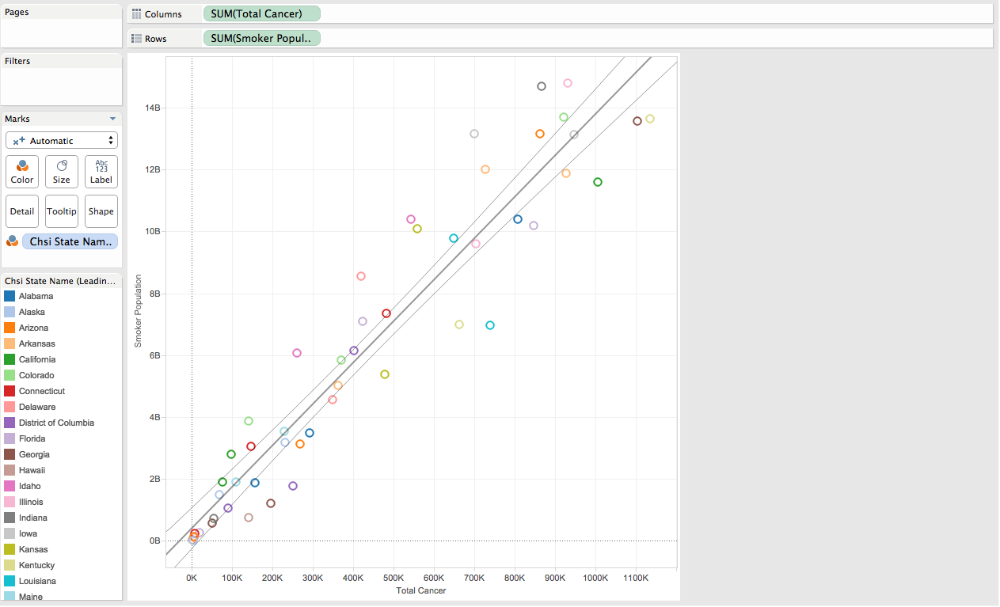
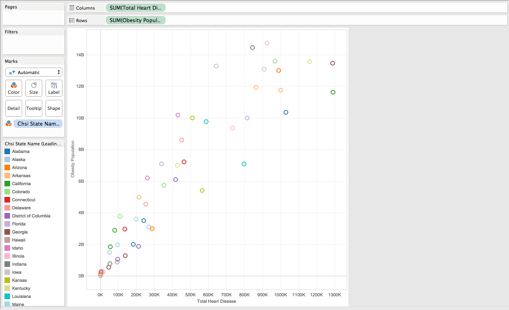
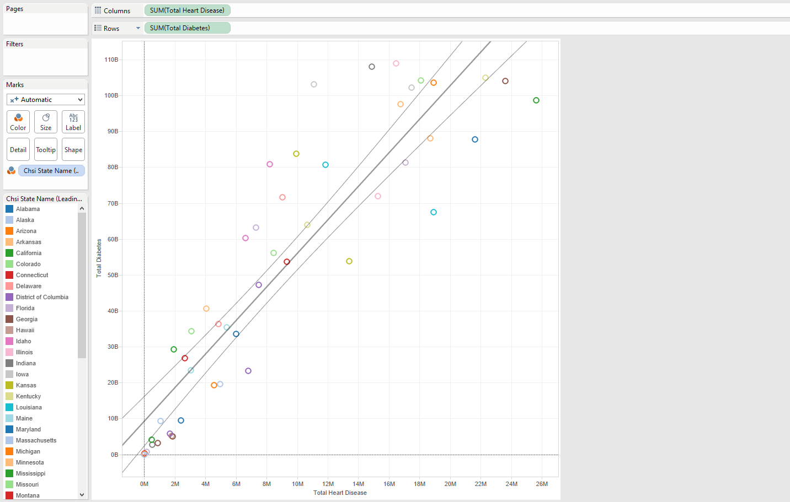
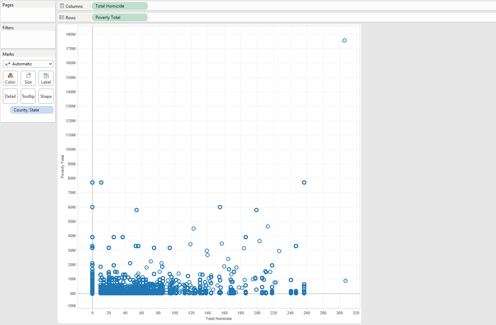

***
***
For this project, we use the data for "Community Health Status Indicators (CHSI) to Combat Obesity, Heart Disease and Cancer". This dataset was created and collected by the U.S Department of Health and Human Services to combat health related causes of death such as obesity, heart disease, cancer, physical activity, and smoking. The data is designed for health care professionals and community members alike to identify behavioral factors that contribute to death in the United States and to be proactive in getting this information out to the general public.

####Data Structure
There are over 200 measures for each of the 2,141 United States counties.

The data is distributed across 9 tables. In this project, 3 tables were used:

* Demographics - breaks down the country by county, describing race and age

* Leading Causes of Death - describes the leading causes of death in each county

* Risk Factors and Access to Care - percentage of people taking part in risk related activities (smoking, diabetes, no exercise)

####Data Management

First, open Oracle SQL Developer and import the data for DEMOGRAPHICS, LEADINGCAUSESOFDEATH (renamed LEADING_CAUSES) and RISKFACTORSANDACCESSTOCARE (renamed RISK_FACTORS). Or skip this step and connect to the cs329e server with the respective UTEid's. 

Next, open Tableau and select "Connect to Data". Select Oracle from the list of servers and connect using:

Server: 129.152.144.84

Service: ORCL.usuniversi01134.oraclecloud.internal

Port: 1521

Username: C##cs329e_UTEid

Password: orcl_UTEid

####Hypothesis 1: Smoking is a leading risk factor in cancer related deaths.

There are a number of reasons that smoking can be a factor in cancer related deaths. Here a few that we have found through research.

* Cancerous cells are created by damaging our DNA. This can be done in numerous different ways.
* Many of the chemicals found in cigarettes have been shown to cause DNA damage, including benzene, polonium-210, benzo(a)pyrene and nitrosamines.
* Also found in cigarettes, chromium makes poisons like benzo(a)pyrene stick more strongly to DNA, increasing the chances of serious damage. And chemicals like arsenic and nickel interfere with pathways for repairing damaged DNA. 

Here we can see a clear indication that an increase in smokers in the state relates to an increase in cancer related deaths. Cancer is not subdivided into the different forms such as lung, prostate, or throat, but a relationship still persists. 

####Hypothesis 2: Obesity is a leading health factor in heart disease related deaths.

Now obesity is the risk factor compared to the cause of death from heart disease. Similar to the previous visualization we will use a scatterplot to see the correlation, if there is any, between the stereotypically associated variables. Number of obese individauls are plotted with the population portion that have died as a result of heart disease. Again a calculated field was created to sum all the deaths that related to heart disease.

Here are a few key points found during research that support the hypothesis:

* Heart disease is an umbrella term for diseases related to the heart and blood vessels. Typically heart disease is the buildup of plaque in the walls of our arteries, leading to complications with blood flow.
* Our bodies are meant to be lean and thus promote a high metabolism. Weight slows down our metabolism
Increased weight can affect blood pressure by creating artificial pressure from the fat pushing on blood vessels. 
* This increase in blood pressure can lead to diabetes as it interferes with our ability to use insulin effectively.

A fan pattern is visible that shows a linear correlation of greater number of heart disease as a cause of death when there is a larger obesity population.

####Hypothesis 3: Diabetes is a leading health factor in heart disease related deaths.

Diabetes is a complication of obesity, but we wanted to see if diabetes alone has a correlation with heart disease in our country. It is possible that diabetes and obesity overlap heavily and thus the relationships are similiar.

####Hypothesis 4: A high poverty rate is related to a high homicide rate

A study conducted by Robert Lee of the Mississippi State University found a relationship with poverty, race, and homicide. 

The issue is a sociological one and not an economic one, according to the study.

Places with high rates of poverty are susceptible to crime due to the lacking infrastructure to keep the area safe. Homicide could be a byproduct of this.

####Conclusions

*Smoking is bad.

*Obesity can lead to a number of complications. Stay healthy!

*Poverty does not seem to have a relationship with homicide.

